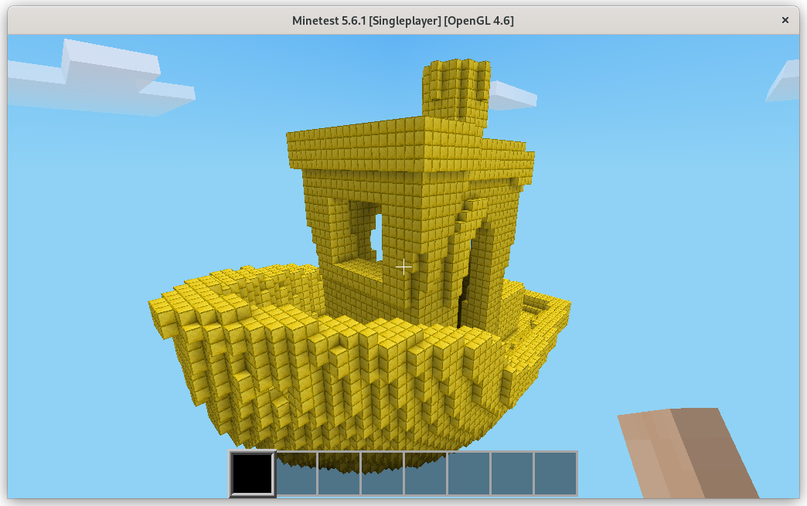
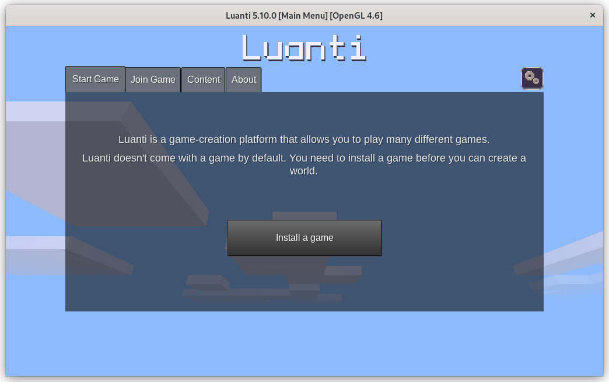
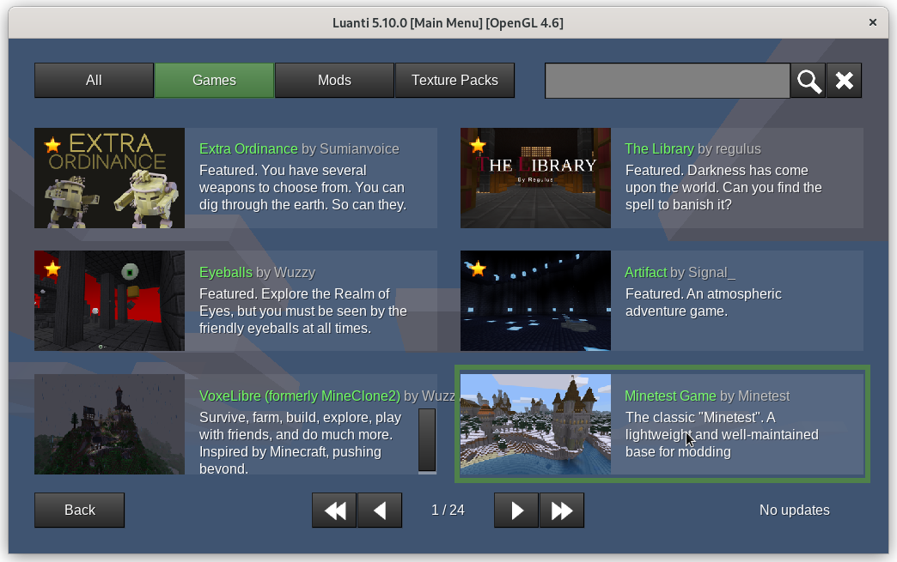
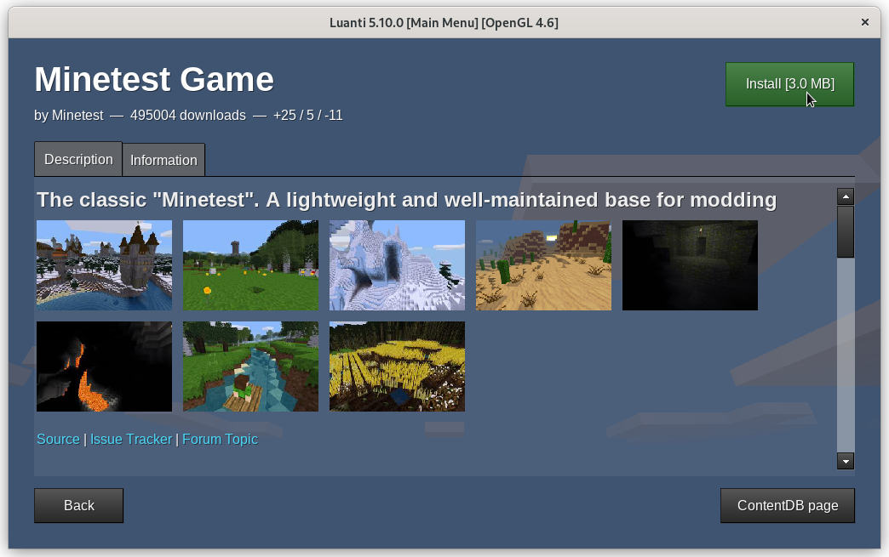
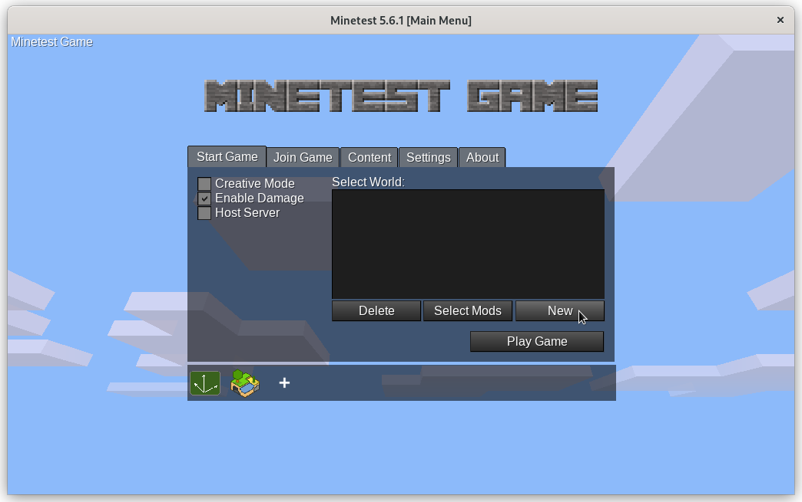
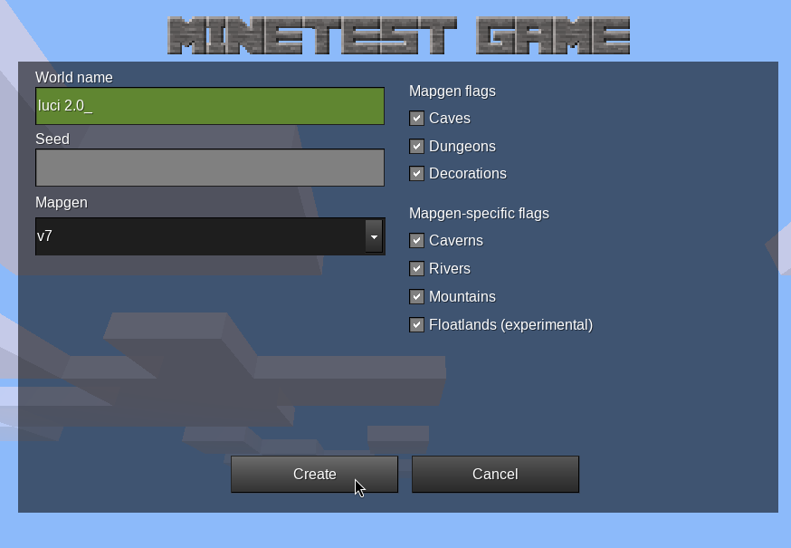
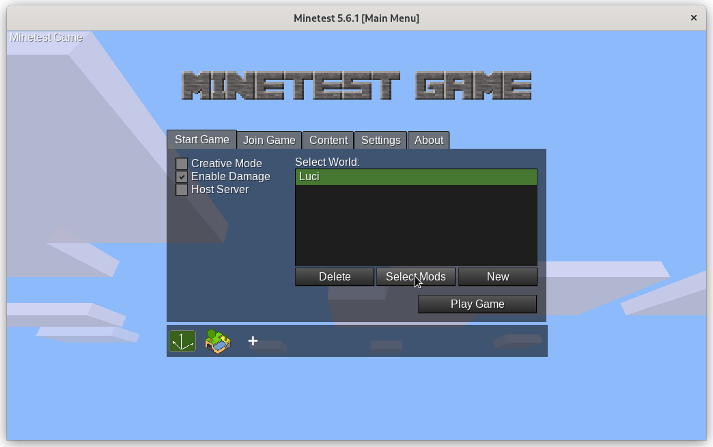
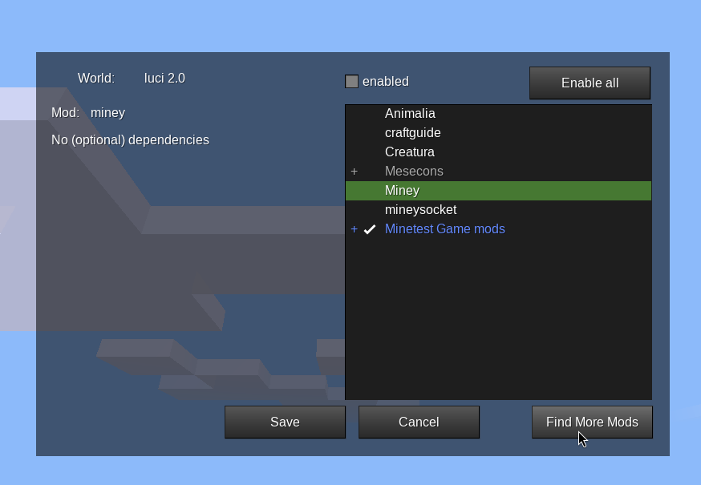
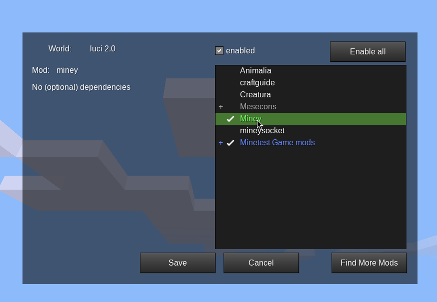
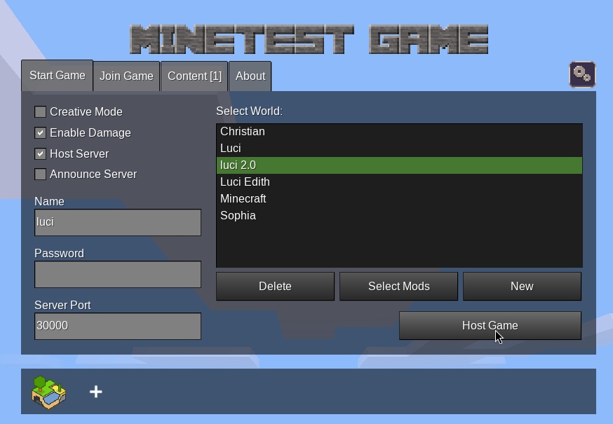

# 📦️ LuCI - Luanti Commandline Interface

This Commandline Interface allows you to build CAD-Objects in [**luanti**](https://www.luanti.org/). For example the benchy from here: https://www.thingiverse.com/thing:763622. The game used to be called minetest, but now it's called luanti, so this description is a mixture of minetest and luanti.



It's depending on [`miney`](https://miney.readthedocs.io/en/latest/) a python interface for luanti.

## Usage

Getting help.

```bash
luci --help
```

Build a CAD-Object in the STL format with `luci`.

```bash
luci build --help
luci build data/some_stl_file.stl
# get all wool blocks
luci blocks --filter wool
# build object with green wool
luci build data/some_stl_file.stl --block-type wool:green
# scale by factor 2
luci build data/some_stl_file.stl --scale 2
# build object at exact position. Default is at the players position.
luci build data/some_stl_file.stl -x 100 -y 150 -z 50
```

Erase this CAD-Object.

```bash
luci erase --help
luci erase data/some_stl_file.stl
# erase scale by factor 2
luci erase data/some_stl_file.stl --scale 2
```


## Installation

If you like to use `luci` you have to follow this steps.

1. Install **luanti** (see here: https://www.luanti.org/downloads/) and the `miney` mod. I use Debian and therefore install it like this:

    ```bash
    sudo apt update
    sudo apt install luanti -y
    ```

    You should now be possible to start luanti.

    ```bash
    luanti
    ```

2. Install `luanti_cli` with pipx.

    ```bash
    sudo apt install pipx -y
    pipx ensurepath
    pipx install luanti_cli
    pipx upgrade luanti_cli
    ```

3. (Optional) Install `Minetest Game` as the classic game. This is required in newer versions of `luanti`.

    

    

    

    You now can click twice *Back* and are ready to play `luanti` without `luci`.

4. Create game, install `miney` mod, enable `miney` mod, enable server and start game.

    

    

    

    

    

    

5. Grant player `luci` all privileges.

    - *Shift* + */*

    - Type `/grant luci all`

    - Hit enter.

5. Build a STL-Object.

    ```bash
    luci build data/some_stl_file.stl
    # and erase it
    luci erase data/some_stl_file.stl
    ```

## Development

```bash
git clone https://github.com/lookslikematrix/luci
cd luci
python -m venv --prompt "📦️ luci" .venv
source .venv/bin/activate
pip install uv
uv sync --extra test
pytest
```

---

❤️ A thousand thanks to the developers of [`miney`](https://github.com/miney-py/miney) Python interface: https://github.com/miney-py

❤️ Everyone is welcome to make a contribution to this project.
